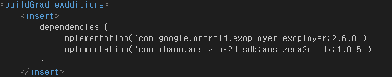
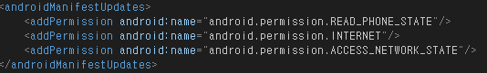
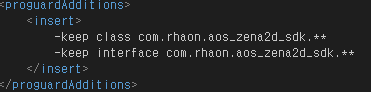
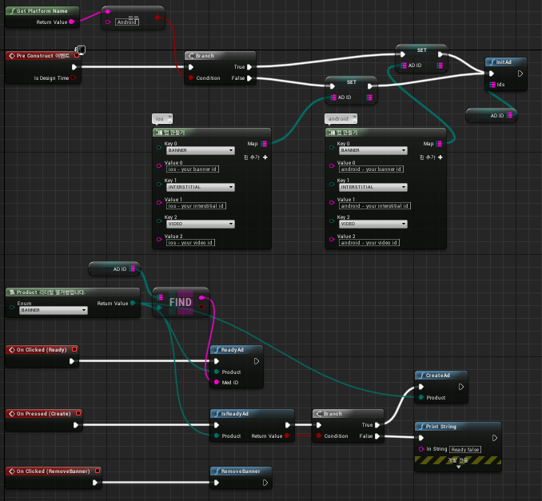
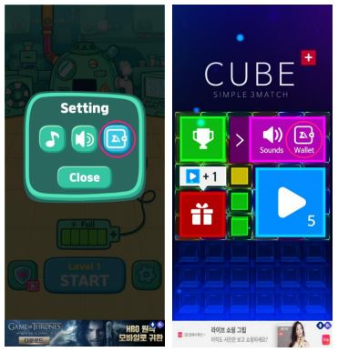

# 언리얼 샘플가이드 &nbsp;<sub>[En](./README.md)</sub>&nbsp;<sub>[Ko](./README.ko.md)</sub>

1. [개요](#1-개요)

2. [제나애드 웹 콘솔에서 광고생성 및 광고 ID 가져오기](#2-제나애드-웹-콘솔에서-광고생성-및-광고-id-가져오기)

3. [샘플 프로젝트](#3-샘플-프로젝트)
    * ue_sample.uproject 파일
    * Config 폴더
    * Content 폴더
    * Source\ThirdParty 폴더
    * Source\ue_sample 폴더

4. [설정](#4-설정)
    * Android : ue_sample_APL.xml – 파일
    * iOS

5. [연동하기](#5-연동하기)
    * SDK 초기화
    * 광고 준비요청
    * 광고 준비확인
    * 광고 보이기
    * 배너 위치 지정
    * 배너 제거
    * 제나애드 페이지 (가상자산)
    * 코드 샘플
    * 콜백 목록
    * 콜백 매개변수 목록
    * 서버응답 메시지 목록

6. [테스트 및 승인요청](#6-테스트-및-승인요청)
    * 테스트
    * 승인 요청방법

7. [추가정보](#7-추가정보)

<br/><br/><br/><br/><br/>

## 1. 개요
---
<br/>

* 함께 제공된 샘플 프로젝트 기반의 가이드 문서입니다.

* android API Level 19 이상, iOS 9.0 이상의 환경에서 적용을 권장하며 제나애드 웹 콘솔에서 발급받은 “광고 ID” 및 최신 SDK 가 별도로 필요합니다.

* 샘플 프로젝트 실행시에는 실제 발급받은 “광고 ID”로 수정 후 실행해야 합니다. SampleWidgetBlueprint 에서 수정할 수 있습니다.

<br/><br/>

## 2. 제나애드 웹 콘솔에서 광고생성 및 광고 id 가져오기
---
<br/>

1. 앱 생성. (앱 관리 / 앱 생성)

2. 광고 생성. (광고 관리 / 광고 생성)

3. 생성된 광고에 "광고 ID"를 이용해 프로젝트 내에서 함수를 실행 할 수 있습니다.

<br/><br/>

## 3. 샘플 프로젝트
---
<br/>

* ue_sample.uproject 파일

    - 프로젝트의 모듈 및 타겟 플랫폼이 지정된 파일입니다. 마우스 우클릭 -> Generate…prjecte files 로 C++프로젝트 파일을 생성합니다.

<br/>

* Config 폴더

    - 기본설정 ini 파일이 있는 폴더입니다.

<br/>

* Content 폴더

    - 샘플 프로젝트에서 사용중인 맵과 블루프린터 파일이 있는 폴더입니다.

<br/>

* Source\ThirdParty 폴더

    - 실제 sdk 파일이 위치하는 경로입니다. (Android, iOS 패키지)

<br/>

* Source\ue_sample 폴더

    - 프로젝트의 메인모듈 경로입니다. 각 sdk 를 접근하는 코드가 포함되어 있습니다.

    - ue_sample.Build.cs : 타겟플랫폼과 포함할 모듈지정 및 각 sdk 경로가 지정된 파일입니다.

    - ue_sample_APL.xml : ue_sample.Build.cs 에서 지정되어 있으면 안드로이드의 퍼미션, 임포트 및 상세 설정을 여기서 설정합니다.

<br/><br/>

## 4. 설정
---
<br/>

* Android : ue_sample_APL.xml – 파일

    - .aar 파일의 경로 지정

        

    - zena2d 에서는 exoPlayer 2.6.0 을 활용하기 때문에 exoPlayer 모듈도 필요로 합니다.

        

    - 필수 퍼미션

        

    - Proguard 적용 후 광고가 보이지 않을 경우를 대비한 옵션

        

<br/>

* iOS

    - 네트워크를 사용하기 위해 프로젝트 세팅 – 플랫폼 - iOS 에서 아래 옵션이 필요합니다.

       

    - iOS 14 이상에서는 IDFA 정책 변경으로 프로젝트 세팅 – 플랫폼 - iOS 에서 아래 옵션이 필요합니다.   
    (<key>NSUserTrackingUsageDescription</key><string>The app is trying to access IDFA for advertising purposes.</string>)

       

<br/><br/>

## 5. 연동하기
---
<br/>

샘플 프로젝트 내에는 sampleMap 과 sampleWidgetBluePrint 이 만들어져 있으며 레벨 블루프린트를 열어보면 sampleWidgetBluePrint 생성 -> 뷰포트에 붙이고 있습니다.   
sampleWidgetBluePrint 에는 sdk 의 api 를 호출할 수 있는 버튼이 배치되어 있고 그래프 탭을 보면 sdk 초기화와 버튼 터치시 호출 api 의 연결흐름을 볼 수 있습니다.

<br/>

&nbsp;&nbsp;&nbsp;&nbsp;&nbsp;&nbsp;&nbsp;&nbsp;&nbsp;

<br/>

아래는 Zena2d.h 와 Zena2d.cpp 의 api 설명입니다.

* SDK 초기화
    ```c++
    static void InitAd(const TMap<Product, FString> ids);
    ```
<br/>

* 광고 준비요청
    ```c++
    static void ReadyAd(const Product product, const FString medID);
    // Product : Product::BANNER, Product::INTERSTITIAL, Product::VIDEO
    // (광고종류 : 배너광고, 전면광고, 동영상광고)
    ```
<br/>

* 광고 준비확인
    ```c++
    static bool IsReadyAd(const Product product);
    // Product : Product::BANNER, Product::INTERSTITIAL, Product::VIDEO
    // (광고종류 : 배너광고, 전면광고, 동영상광고)
    ```
<br/>

* 광고 보이기
    ```c++
    static void CreateAd(const Product product);
    // Product : Product::BANNER, Product::INTERSTITIAL, Product::VIDEO
    // (광고종류 : 배너광고, 전면광고, 동영상광고)
    ```
<br/>

* 배너 위치 지정
    ```c++
    static void SetBannerGravity(const BannerMode mode);
    // BannerMode : BannerMode::BOTTOM, BannerMode::TOP
    // (배너위치 : 하단, 상단)
    ```
<br/>

* 배너 제거
    ```c++
    static void RemoveBanner( );
    ```
<br/>

* 제나애드 페이지 (가상자산)

    유저에게 적립된 포인트를 확인/출금 할 수 있는 창으로 게임내 옵션창에 호출 가능한 메뉴를 제공해야 합니다.   
    메뉴의 모양 및 위치는 게임내 옵션창에 자유롭게 노출합니다. (적용 예시 하단에 첨부되어 있는 버튼 사용 가능)
    ```c#
    static void CreatePointWindow();
    ```
    <br/>

    - 적용 예시

        </img>

    <br/>

    - 버튼 다운로드

        <a href="https://github.com/zenaad/zenaadresources/blob/main/adIcon/wallet_c.png" target="_blank">
        </a>
        &nbsp;&nbsp;&nbsp;&nbsp;&nbsp;&nbsp;
        <a href="https://github.com/zenaad/zenaadresources/blob/main/adIcon/wallet_w.png" target="_blank">
        </a>
    
<br/>

* 코드 샘플
    ```c++
    #include "Zena2d.h"
    #include "Engine/GameEngine.h"
    #include "Zena2dClient.h"
    
    void UZena2d::InitAd(const TMap<Product, FString> ids) {
        Client* client = Zena2dClient::BuildClient();
        client->callbackInit = UZena2d::OnInit;
        client->callbackError = UZena2d::OnError;
        client->callbackReady = UZena2d::OnReady;
        client->callbackCreate = UZena2d::OnCreate;
        client->callbackReward = UZena2d::OnReward;
        client->callbackClick = UZena2d::OnClick;
        client->callbackClose = UZena2d::OnClose;
        
        FString banner_id = ids.FindRef(Product:: BANNER);
        FString interstitial_id = ids.FindRef(Product:: INTERSTITIAL);
        FString video_id = ids.FindRef(Product:: VIDEO);
        
        client->Init(banner_id, interstitial_id, video_id);
    }
    
    void UZena2d::ReadyAd(const Product product, const FString medID) {
        Zena2dClient::getClient()->ReadyAd((int32)product, medID);
    }

    bool UZena2d::IsReadyAd(const Product product) {
        return Zena2dClient::getClient()->IsReadyAd((int32)product);
    }
    
    void UZena2d::CreateAd(const Product product) {
        Zena2dClient::getClient()->CreateAd((int32)product);
    }

    void UZena2d::SetBannerGravity(const BannerMode mode) {
        Zena2dClient::getClient()->SetBannerGravity((int32)mode);
    }

    void UZena2d::RemoveBanner() {
        Zena2dClient::getClient()->RemoveBanner();
    }

    void UZena2d::CreatePointWindow() {
        Zena2dClient::getClient()->CreatePointWindow();
    }

    //--------------------callback--------------------//
    
    void UZena2d::OnInit(bool isInit, FString message) {
        Log(FString::Printf(TEXT("OnInit : %d : %s"), isInit, *message));
    }

    void UZena2d::OnError(int32 product, FString message, FString detail) {
        Log(FString::Printf(TEXT("OnError : %d : %s : %s"), product, *message, *detail));
    }

    void UZena2d::OnReady(int32 product, bool success, FString message) {
        Log(FString::Printf(TEXT("OnReady : %d : %d : %s"), product, success, *message));
    }

    void UZena2d::OnCreate(int32 product, bool success, FString message) {
        Log(FString::Printf(TEXT("OnCreate : %d : %d : %s"), product, success, *message));
    }

    void UZena2d::OnReward(int32 product, FString reward, int32 count) {
        Log(FString::Printf(TEXT("OnReward : %d : %s : %d"), product, *reward, count));
    }

    void UZena2d::OnClick(int32 product) {
        Log(FString::Printf(TEXT("OnClick : %d"), product));
    }

    void UZena2d::OnClose(int32 product, FString medID) {
        Log(FString::Printf(TEXT("OnClose : %d : %s"), product, *medID));
    }

    void UZena2d::Log(FString log) {
        if (GEngine) GEngine->AddOnScreenDebugMessage(-1, 5.0f, FColor::Cyan, log, true, FVector2D(1.f, 1.f));
    }
    ```
<br/>

* 콜백 목록

    |콜백|설명|
    |---|---|
    |callbackInit(bool, FString) |UZena2d::InitAd( ); -> SDK 초기화 후 성공여부.|
    |callbackError(int32, FString, FString) |네트워킹 오류 및 응답 오류시 호출됩니다.|
    |callbackReady(int32, bool, FString) |UZena2d::ReadyAd( ); -> 광고요청, 광고로드를 진행하며 광고준비 성공여부.|
    |callbackCreate(int32, bool, FString) |UZena2d::IsReadyAd( ); -> 준비된 광고를 표시.|
    |callbackReward(int32, FString, int32) |보상형 광고의 보상조건 충족시 호출.|
    |callbackClick(int32) |광고 클릭시 호출.|
    |callbackClose(int32, FString) |광고 및 포인트 윈도우가 닫힐때 호출.|
<br/>

* 콜백 매개변수 목록

    |매개변수|설명|
    |---|---|
    |bool isInit |광고연동 준비상태.|
    |bool success |해당함수의 성공여부.|
    |FString message |응답에 대한 상태 및 메시지.|
    |FString detail |에러발생시 디테일 메시지.|
    |FString reward |보상형 광고에서 설정한 보상이름.|
    |FString medID |광고 준비시 전달한 medID.|
    |int32 product |광고 구분 - 0 or 1 or 2 (0 : BANNER, 1 : INTERSTITIAL, 2 : VIDEO)|
    |int32 count |보상형 광고에서 설정한 보상갯수.|
<br/>

* 서버응답 메시지 목록

    |메시지|설명|
    |---|---|
    |SUCCESS |성공.|
    |UNKNOWN |알 수 없는 에러입니다.|
    |UNKNOWN_MEDID |알 수 없는 미디어(광고) 아이디 입니다.|
    |AD_DISABLED |광고 비활성화 상태입니다. (웹콘솔 광고 관리에서 노출 중지 한 경우)|
    |AD_NOTFOUND |광고가 없습니다.|
    |AD_EXPIRED |준비된 광고가 만료되었습니다. ReadyAd( )가 필요합니다.|
    |ALREADY_ADREQ |중복된 광고 요청입니다. – sdk 에러.|
    |EXCEEDED_IMPRESSION |노출횟수가 초과 되었습니다. (웹콘솔 광고 관리에서 노출 횟수를 설정한 경우)|

<br/><br/>

## 6. 테스트 및 승인요청
---
<br/>

* 테스트

    - 아래와 같은 제나애드 기본광고가 노출되면 정상입니다.

        |타입|보기|
        |:---:|:---:|
        |배너 |</img>|
        |전면 |</img>|
        |비디오 |</img>|
<br/>

* 승인 요청방법

    - 출시 직전이나 출시 후 승인 요청하면 실제광고가 노출되고 정산됩니다.

    - 다음은 승인요청 메일 예시입니다.   
    <br/>
    수신 : help@zenaad.com <br/>
    내용 : 제나애드 계정 이메일 (필수) : 예) publisher@zenaad.com <br/>
    &nbsp;&nbsp;&nbsp;&nbsp;&nbsp;&nbsp; 회사명 (필수) : 예) (주)제나애드 <br/>
    &nbsp;&nbsp;&nbsp;&nbsp;&nbsp;&nbsp; 앱 이름 (필수) : 될 수 있으면 스토어에서 검색 가능한 이름 <br/>
    &nbsp;&nbsp;&nbsp;&nbsp;&nbsp;&nbsp; 스토어 주소 (선택) : 유효한 URL 주소

<br/><br/>

## 7. 추가정보
---
<br/>

* Zena2D 에서는 광고식별자 (ADID, IDFA)를 활용하며 리소스의 효율적인 사용을 위해 캐쉬 데이터를 저장합니다. (최대 256MB)

<br/><br/>
