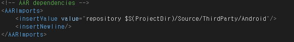
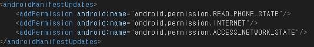
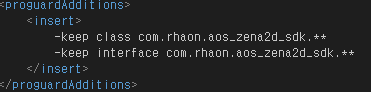
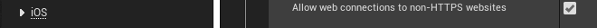
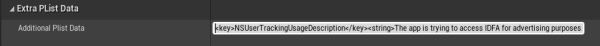
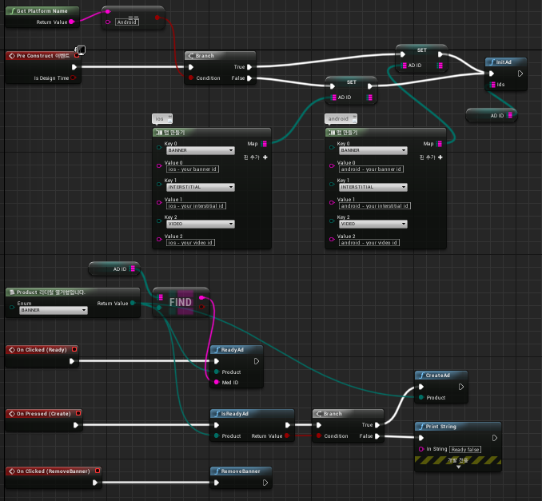
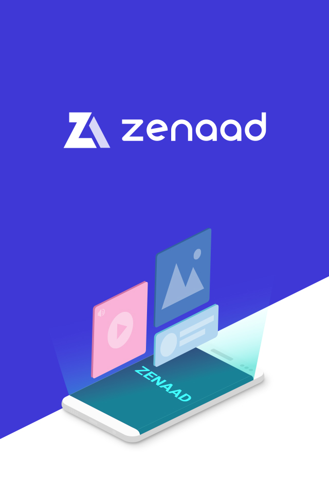

# UNREAL GUIDE &nbsp;<sub>[En](./README.md)</sub>&nbsp;<sub>[Ko](./README.ko.md)</sub>

1. [Overview](#1-overview)

2. [Create an ad in the Zenaad web console and add an Ad ID](#2-create-an-ad-in-the-zenaad-web-console-and-add-an-ad-id)

3. [Sample Project](#3-sample-project)
    * ue_sample.uproject - File
    * Config - Folder
    * Content - Folder
    * Source\ThirdParty - Folder
    * Source\ue_sample - Folder

4. [Setting](#4-setting)
    * Android : ue_sample_APL.xml - File
    * iOS

5. [Link](#5-link)
    * Initialize SDK
    * Request AD ready
    * Confirm ad ready
    * Show Ad
    * Position the banner
    * Remove banner
    * ZenaAD Page (VirtualAssets)
    * Code Sample
    * IListenerZena2d Callback
    * Callback Parameter List
    * Server Response Message List

6. [Test and Approval Request](#6-test-and-approval-request)
    * Test
    * Requesting Approva

7. [Additional Information](#7-additional-information)

<br/><br/><br/><br/><br/>

## 1. overview
---
<br/>

* It is a guide document based on the sample project provided.

* Compatible with android API Level 19 +, and iOS 9.0 +. The ZenaAD Ad ID and latest SDK from the web console must be obtained separately.

* When running the sample project, run after editing in the issued Ad ID. You can modify it in SampleWidgetBlueprint.

<br/><br/>

## 2. create an ad in the zenaad web console and add an ad id
---
<br/>

1. Create an App. (App Management/App Creation)

2. Create an Ad. (Ad Management/Ad Creation)

3. Functions can be run within your project using the Ad ID in the generated ad.

<br/><br/>

## 3. sample project
---
<br/>

* ue_sample.uproject - File

    - The module and target platform of the project is the specified file. Right click on the mouse -> Generate…project files, Generate a C++project file.

<br/>

* Config - Folder

    - The folder where the default setting .ini file is located.

<br/>

* Content - Folder

    - This folder contains the map and blue printer files that are used in the sample project.

<br/>

* Source\ThirdParty - Folder

    - The path where the actual sdk file is located. (Android, iOS package)

<br/>

* Source\ue_sample - Folder

    - The path to the main module of the project. contains code to sdk access it.

    - ue_sample.Build.cs : This is the file that contains the target platform, the module specification to include, and the sdk path.

    - ue_sample_APL.xml : If specified in ue_sample.Build.cs, set permissions, import and detailed settings for Android here.

<br/><br/>

## 4. setting
---
<br/>

* Android : ue_sample_APL.xml - File

    - Specify the path of the .aar file

        

    - Since zena2d uses exoPlayer 2.6.0, exoPlayer module is also needed.

        

    - Necessary permissions

        

    - Options in case you can not see the advertisement after applying Proguard.

        

<br/>

* iOS

    - To use the network, Project Setting - Platform – iOS requires the following options:

       

    - In iOS 14 and above, the following options are required in Project Settings – Platform - iOS due to IDFA policy change.   
    (<key>NSUserTrackingUsageDescription</key><string>The app is trying to access IDFA for advertising purposes.</string>)

       

<br/><br/>

## 5. link
---
<br/>

SampleMap and sampleWidgetBluePrint are created in the sample project. When you open the level blueprint, it is attached to sampleWidgetBluePrint creation -> viewport.   
SampleWidgetBluePrint has a button that calls sdk's api. If you look at the Graph tab, you can see the connection flow of the calling api when you initialize the sdk and touch the button.

<br/>

&nbsp;&nbsp;&nbsp;&nbsp;&nbsp;&nbsp;&nbsp;&nbsp;&nbsp;

<br/>

Below is a description of the api in Zena2d.h and Zena2d.cpp.

* Initialize SDK
    ```c++
    static void InitAd(const TMap<Product, FString> ids);
    ```
<br/>

* Request AD ready
    ```c++
    static void ReadyAd(const Product product, const FString medID);
    // Product : Product::BANNER, Product::INTERSTITIAL, Product::VIDEO
    // (Ad types : Banner Ad, Full-screen Ad, Video Ad)
    ```
<br/>

* Confirm ad ready
    ```c++
    static bool IsReadyAd(const Product product);
    // Product : Product::BANNER, Product::INTERSTITIAL, Product::VIDEO
    // (Ad types : Banner Ad, Full-screen Ad, Video Ad)
    ```
<br/>

* Show Ad
    ```c++
    static void CreateAd(const Product product);
    // Product : Product::BANNER, Product::INTERSTITIAL, Product::VIDEO
    // (Ad types : Banner Ad, Full-screen Ad, Video Ad)
    ```
<br/>

* Position the banner
    ```c++
    static void SetBannerGravity(const BannerMode mode);
    // BannerMode : BannerMode::BOTTOM, BannerMode::TOP
    // (Banner Position : Bottom, Top)
    ```
<br/>

* Remove banner
    ```c++
    static void RemoveBanner();
    ```
<br/>

* ZenaAD Page (VirtualAssets)

    A callable menu must be provided in the in-game options window with a menu that allows for users to view/withdraw accumulated points.   
    Menu appearance and location are freely displayed in the in-game options window. (Feel free to use the button attached at the bottom of the example)
    ```c++
    static void CreatePointWindow();
    ```
    <br/>

    - Example

        </img>

    <br/>

    - Button Download

        <a href="https://github.com/zenaad/zenaadresources/blob/main/adIcon/wallet_c.png" target="_blank">
        </a>
        &nbsp;&nbsp;&nbsp;&nbsp;&nbsp;&nbsp;
        <a href="https://github.com/zenaad/zenaadresources/blob/main/adIcon/wallet_w.png" target="_blank">
        </a>
    
<br/>

* Code Sample
    ```c++
    #include "Zena2d.h"
    #include "Engine/GameEngine.h"
    #include "Zena2dClient.h"
    
    void UZena2d::InitAd(const TMap<Product, FString> ids) {
        Client* client = Zena2dClient::BuildClient();
        client->callbackInit = UZena2d::OnInit;
        client->callbackError = UZena2d::OnError;
        client->callbackReady = UZena2d::OnReady;
        client->callbackCreate = UZena2d::OnCreate;
        client->callbackReward = UZena2d::OnReward;
        client->callbackClick = UZena2d::OnClick;
        client->callbackClose = UZena2d::OnClose;
        
        FString banner_id = ids.FindRef(Product:: BANNER);
        FString interstitial_id = ids.FindRef(Product:: INTERSTITIAL);
        FString video_id = ids.FindRef(Product:: VIDEO);
        
        client->Init(banner_id, interstitial_id, video_id);
    }
    
    void UZena2d::ReadyAd(const Product product, const FString medID) {
        Zena2dClient::getClient()->ReadyAd((int32)product, medID);
    }

    bool UZena2d::IsReadyAd(const Product product) {
        return Zena2dClient::getClient()->IsReadyAd((int32)product);
    }
    
    void UZena2d::CreateAd(const Product product) {
        Zena2dClient::getClient()->CreateAd((int32)product);
    }

    void UZena2d::SetBannerGravity(const BannerMode mode) {
        Zena2dClient::getClient()->SetBannerGravity((int32)mode);
    }

    void UZena2d::RemoveBanner() {
        Zena2dClient::getClient()->RemoveBanner();
    }

    void UZena2d::CreatePointWindow() {
        Zena2dClient::getClient()->CreatePointWindow();
    }

    //--------------------callback--------------------//
    
    void UZena2d::OnInit(bool isInit, FString message) {
        Log(FString::Printf(TEXT("OnInit : %d : %s"), isInit, *message));
    }

    void UZena2d::OnError(int32 product, FString message, FString detail) {
        Log(FString::Printf(TEXT("OnError : %d : %s : %s"), product, *message, *detail));
    }

    void UZena2d::OnReady(int32 product, bool success, FString message) {
        Log(FString::Printf(TEXT("OnReady : %d : %d : %s"), product, success, *message));
    }

    void UZena2d::OnCreate(int32 product, bool success, FString message) {
        Log(FString::Printf(TEXT("OnCreate : %d : %d : %s"), product, success, *message));
    }

    void UZena2d::OnReward(int32 product, FString reward, int32 count) {
        Log(FString::Printf(TEXT("OnReward : %d : %s : %d"), product, *reward, count));
    }

    void UZena2d::OnClick(int32 product) {
        Log(FString::Printf(TEXT("OnClick : %d"), product));
    }

    void UZena2d::OnClose(int32 product, FString medID) {
        Log(FString::Printf(TEXT("OnClose : %d : %s"), product, *medID));
    }

    void UZena2d::Log(FString log) {
        if (GEngine) GEngine->AddOnScreenDebugMessage(-1, 5.0f, FColor::Cyan, log, true, FVector2D(1.f, 1.f));
    }
    ```
<br/>

* Callback List

    |Callback|Description|
    |---|---|
    |callbackInit(bool, FString) |UZena2d::InitAd( ); -> Initializes SDK and indicates if successful.|
    |callbackError(int32, FString, FString) |Called on network errors and response errors.|
    |callbackReady(int32, bool, FString) |UZena2d::ReadyAd( ); -> Processes an ad request, loads the ad, and indicates if the ad is ready.|
    |callbackCreate(int32, bool, FString) |UZena2d::IsReadyAd( ); -> Displays prepared ad.|
    |callbackReward(int32, FString, int32) |Called when the reward conditions for compensating ads are met.|
    |callbackClick(int32) |Called when an ad is clicked.|
    |callbackClose(int32, FString) |Invoked when the ad and point windows are closed.|
<br/>

* Callback Parameter List

    |Parameter|Description|
    |---|---|
    |bool isInit |Ad ready status.|
    |bool success |Function success/failure.|
    |FString message |Response status and messages.|
    |FString detail |Detailed error message.|
    |FString reward |Name of the reward entered for a compensating ad.|
    |FString medID |The medID sent when preparing an ad.|
    |int32 product |Ad Category - 0 or 1 or 2 (0 : BANNER, 1 : INTERSTITIAL, 2 : VIDEO)|
    |int32 count |The reward count set for a compensating ad.|
<br/>

* Server Response Message List

    |Message|Description|
    |---|---|
    |SUCCESS |Success.|
    |UNKNOWN |Unknown Error.|
    |UNKNOWN_MEDID |Unknown Media (Ad) ID.|
    |AD_DISABLED |Ad is currently disabled. (If broadcast is stopped in the Web Console Ad Management)|
    |AD_NOTFOUND |There is no ad.|
    |AD_EXPIRED |The prepared Ad has expired. ReadyAd( ) needed.|
    |ALREADY_ADREQ |Duplicate Ad request. – sdk error.|
    |EXCEEDED_IMPRESSION |Exposure limit exceeded. (If exposure count is set in the Web Console Ad Management)|

<br/><br/>

## 6. test and approval request
---
<br/>

* Test

    - If the following ZenaAD native ads are displayed, then the system is running normally.

        |Type|Example|
        |:---:|:---:|
        |Banner |</img>|
        |Full-screen |</img>|
        |Video |</img>|
<br/>

* Requesting Approval

    - Requesting approval immediately before or after launch will broadcast your ad and accumulate balance.

    - Here is an example of an approval request email:   
    <br/>
    Contents : help@zenaad.com <br/>
    Company Info : ZenaAD account email (required): ex) publisher@zenaad.com <br/>
    &nbsp;&nbsp;&nbsp;&nbsp;&nbsp;&nbsp; Company Name (required): ex) ZenaAD Co., Ltd. <br/>
    &nbsp;&nbsp;&nbsp;&nbsp;&nbsp;&nbsp; App Name (required):  A searchable name in the Store, if <br/>
    &nbsp;&nbsp;&nbsp;&nbsp;&nbsp;&nbsp; Store Address (optional): Valid URL Address

<br/><br/>

## 7. additional information
---
<br/>

*  ZenaAD uses ad identifiers (ADID, IDFA) and saves cash data for efficient resource use. (Up to 256 MB)

<br/><br/>
